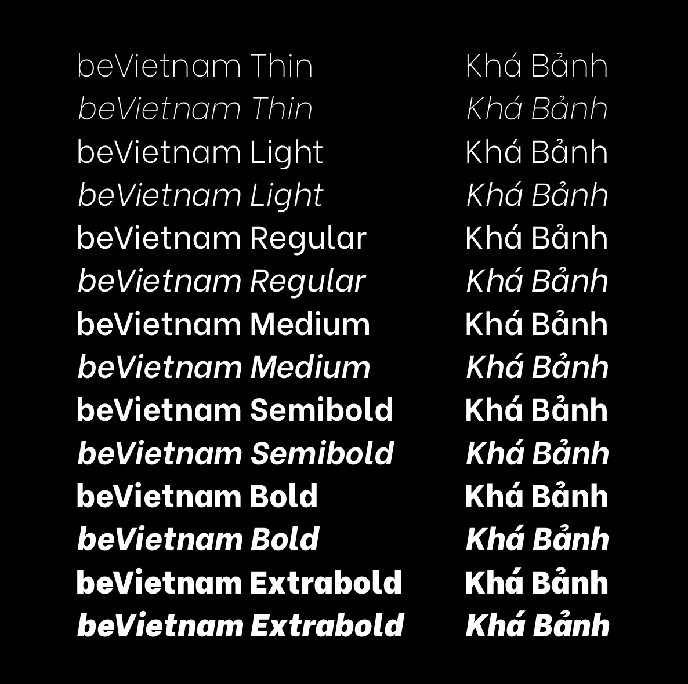
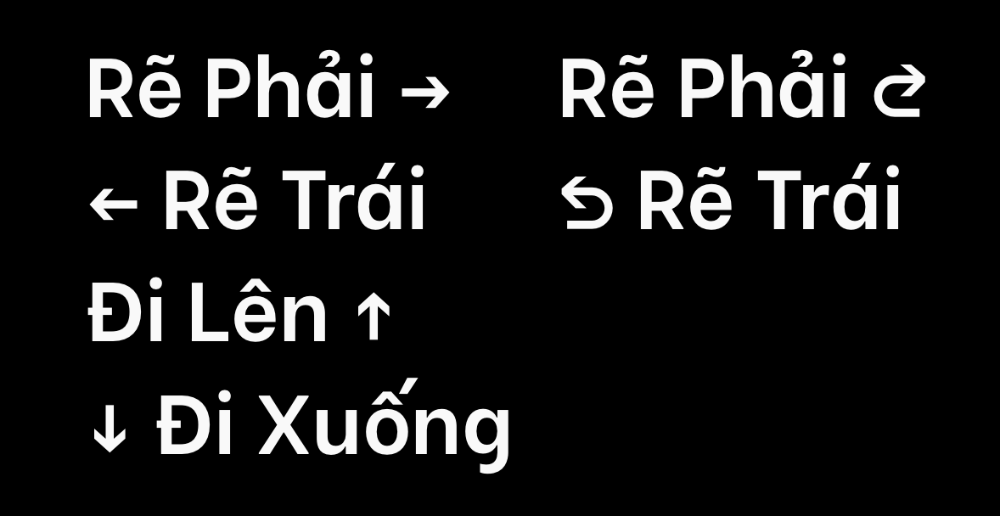
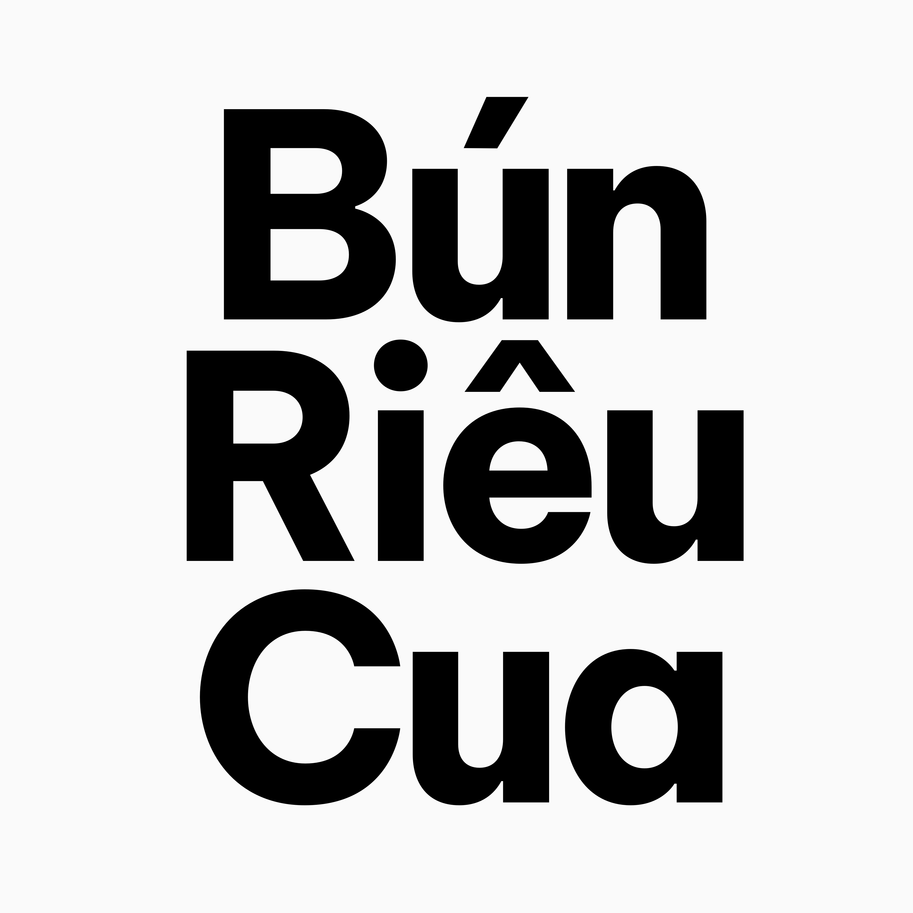
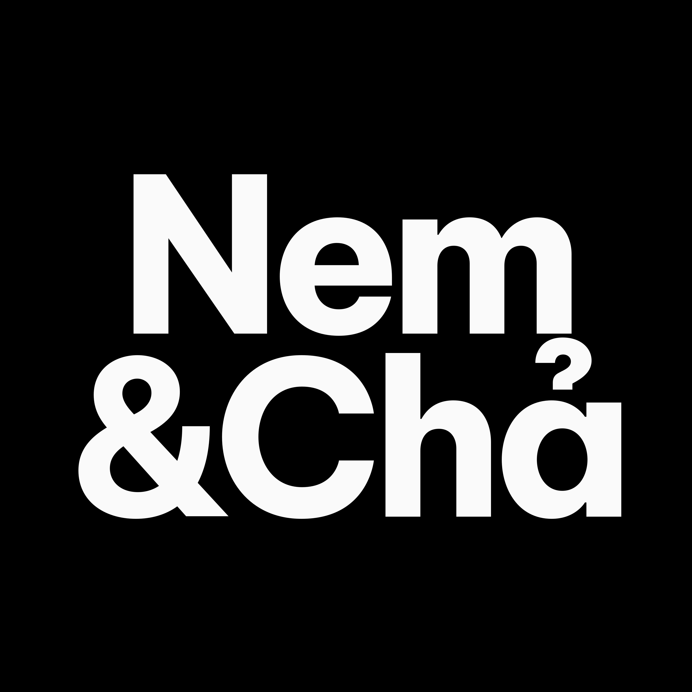
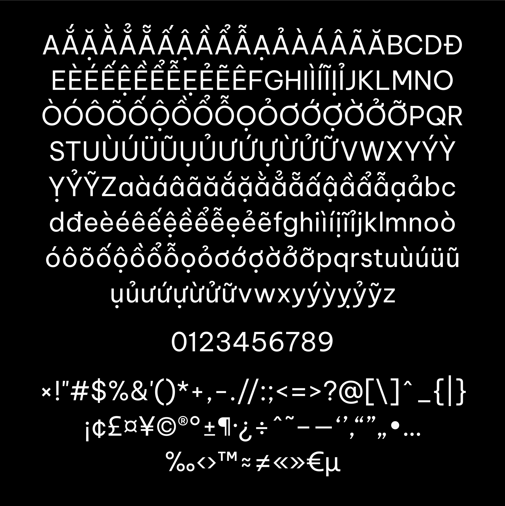
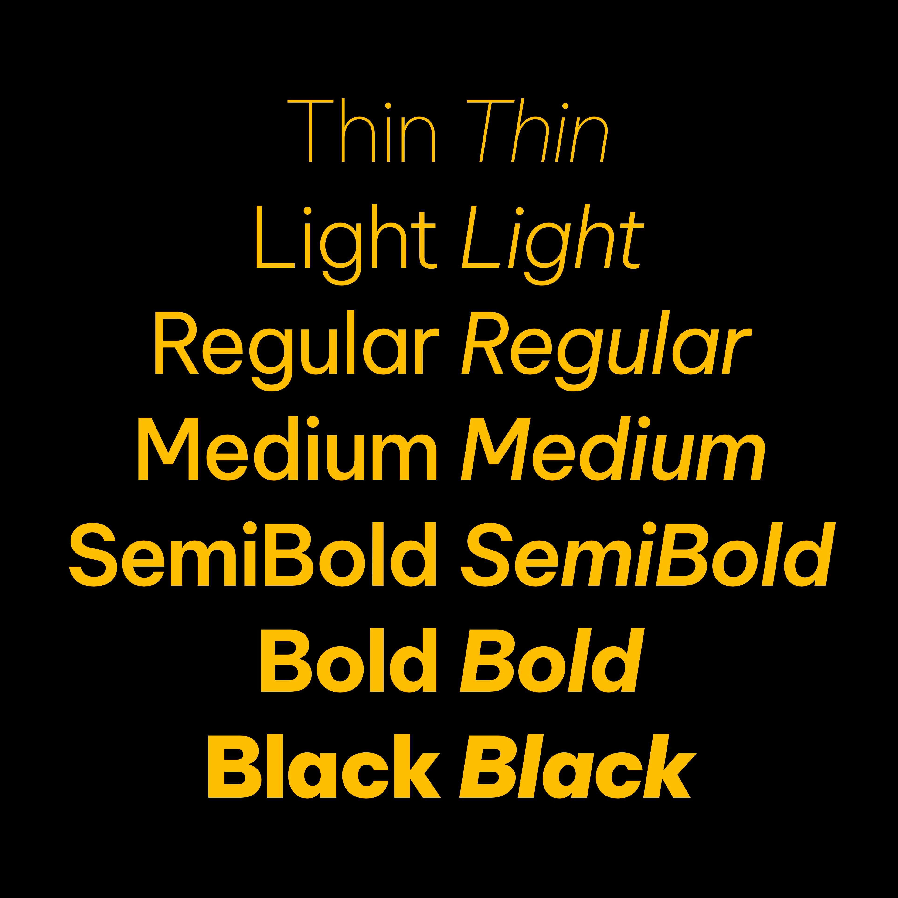

# The Be Vietnam Pro font family

A while ago, [Be Vietnam](https://github.com/bettergui/BeVietnam) was made to compliment the essence of our beloved Tiếng Việt and was lucky enough to be adopted by many millions of users around the globe. But we still want to push our limits further by challenging ourselves to craft an even better typeface that embraces Vietnamese beauty and excellent in functionality & usability, and we call it Be Vietnam Pro.

This new variant inherits the spirit of the original Be Vietnam and takes it to the next level. We refined Vietnamese letterforms with diacritics adaptive forms for specific use cases. We engineered them for better readability; and much more improvements.

We hope you will enjoy Be Vietnam Pro as much as we do, and we cannot wait to see what you can create with it!

